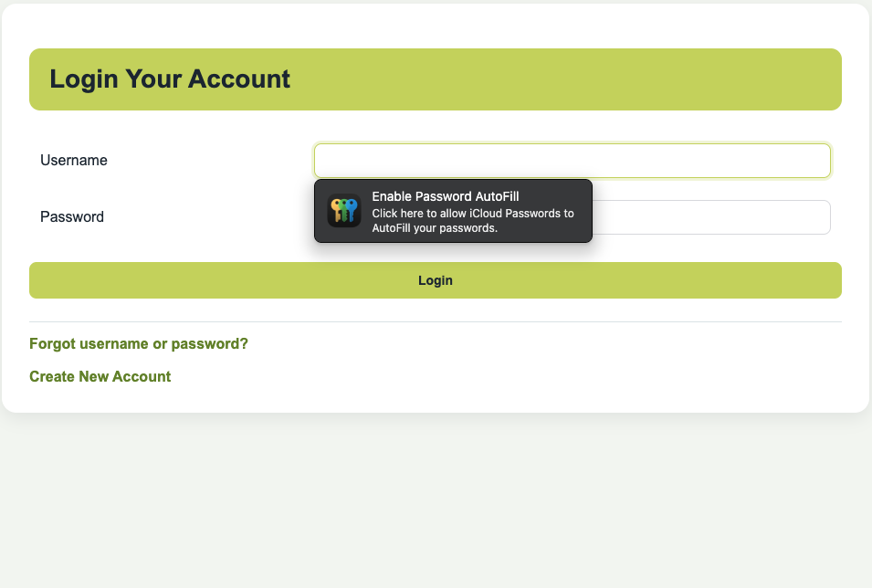
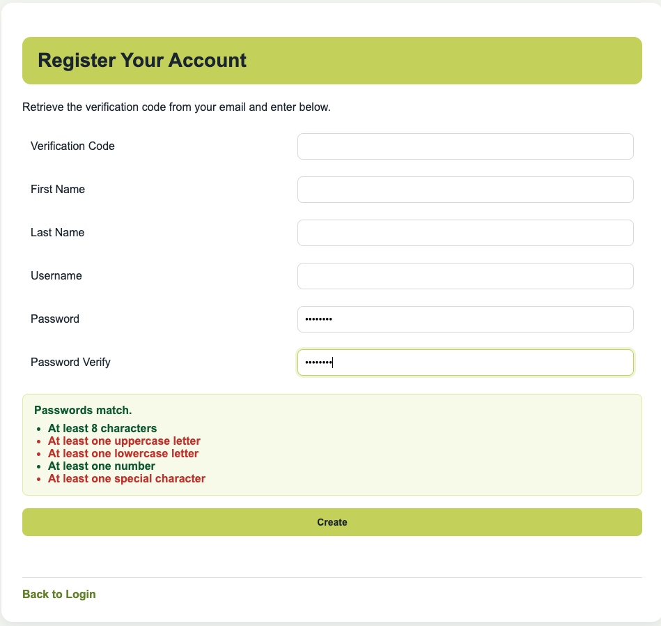
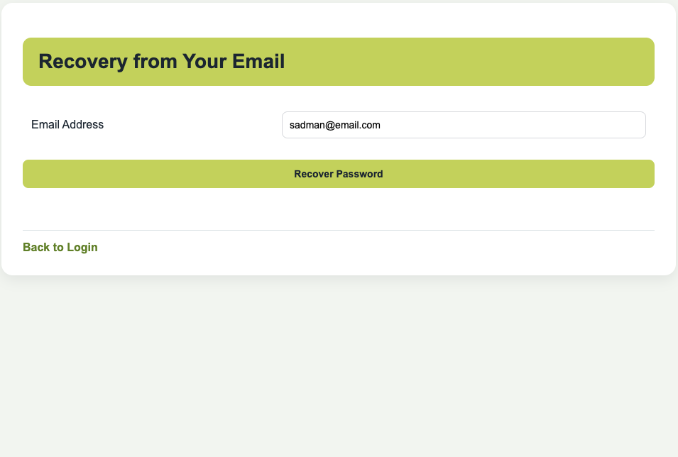
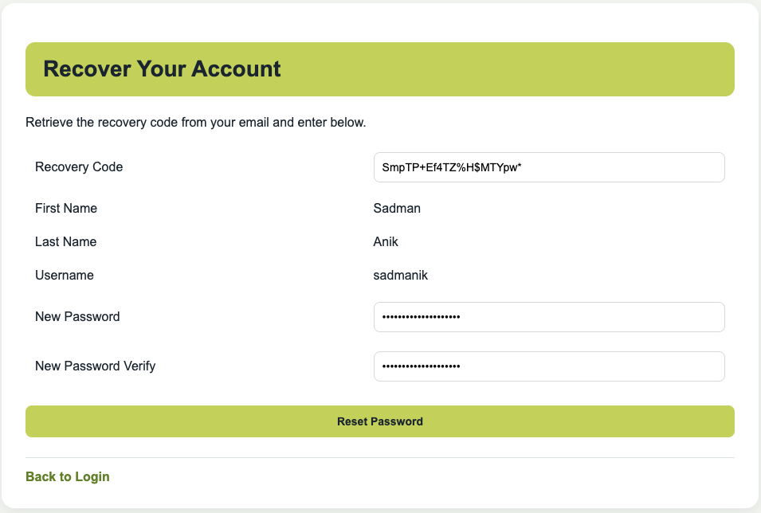
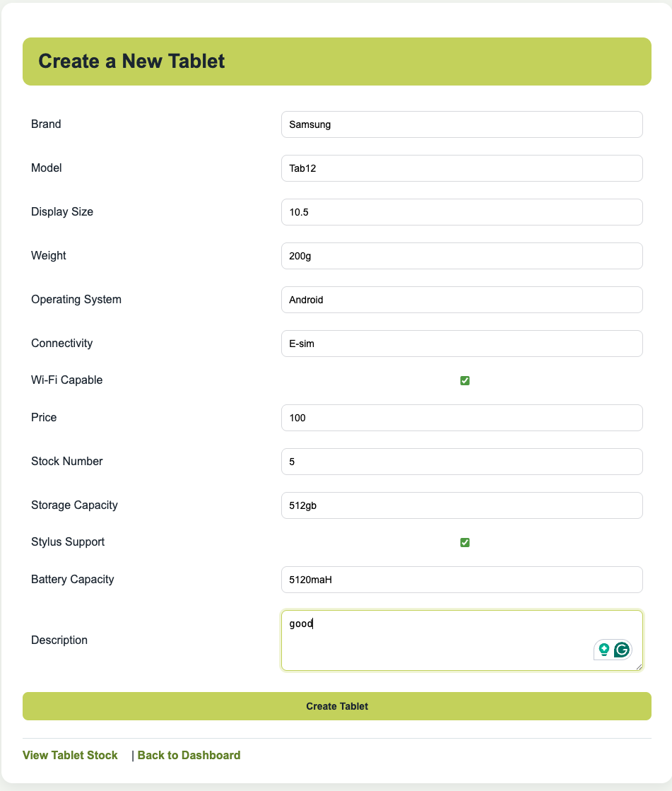
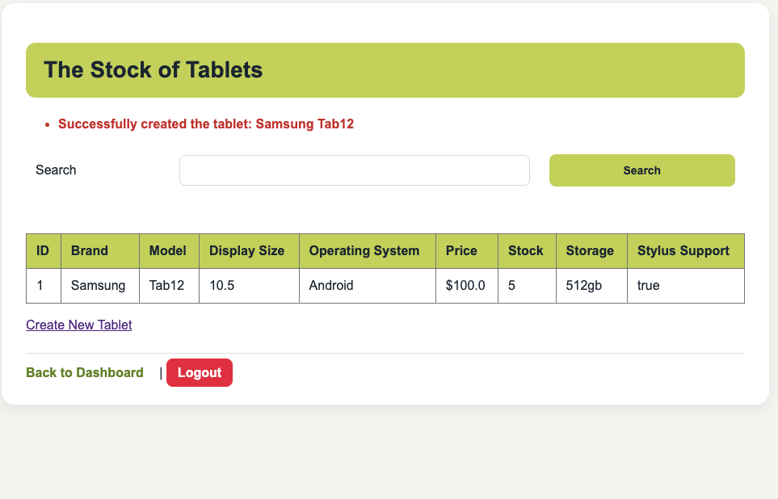
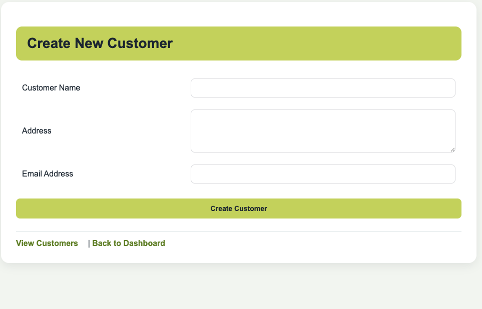
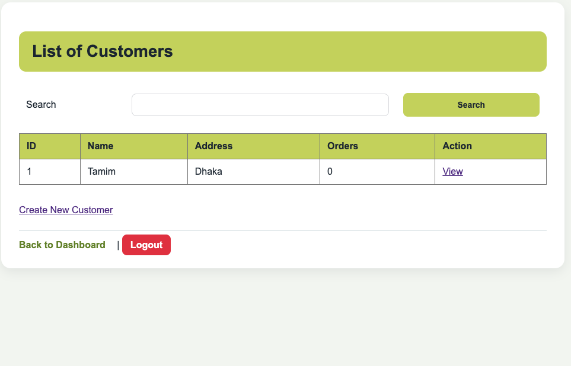
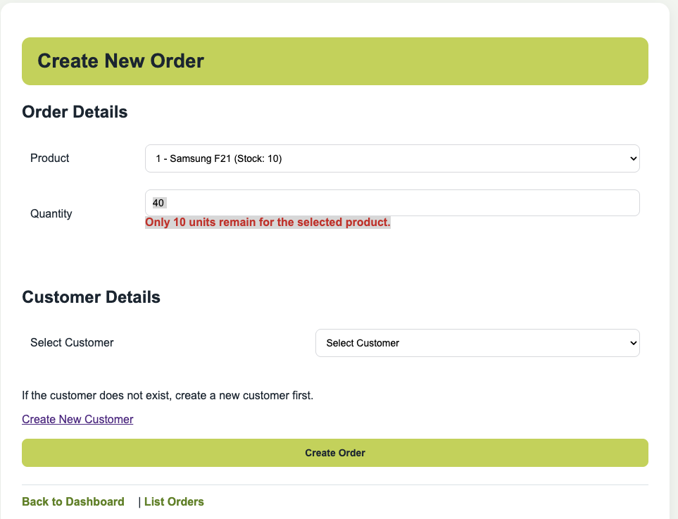
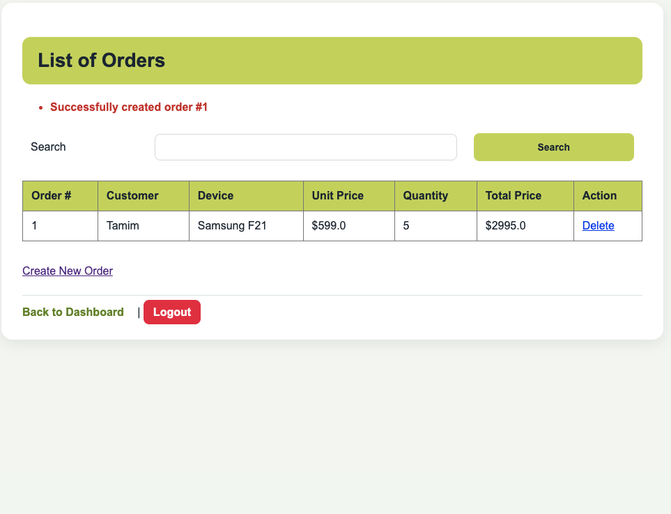

# Application Screenshots

This folder contains screenshots of the Online Electronics Retail Store web application.

## Account Login

Login page with links for account recovery and new account registration.

## Create Account

Registration page with verification code fields and password validation feedback.

## Recover Account

Email recovery form used to request a password recovery code.

Recovery code and password reset page.

## Create Tablet

Tablet creation form with product specification, price, stock, and description fields.

## Tablet List

Tablet stock list with search and navigation actions.

## Add Customer

Customer creation form for name, address, and email details.

## Customer List

Customer list showing customer details, order count, and navigation actions.

## Create Order

Order creation form showing product stock validation when the requested quantity is higher than available stock.

## Order List

Order list showing customer, device, unit price, quantity, total price, and delete action.
